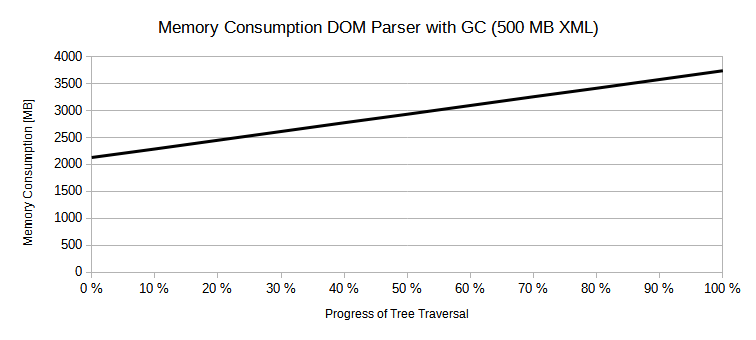

# maXMLian
maXMLian is a high-level stream-based non-validating XML parser for Java with a DOM-like API. Its performance is in the same order as that of a StAX parser, but due to its high-level API it is much more suited for parsing XML documents with a complex structure, particularly when only certain parts of the document tree are of interest.

<!-- START doctoc generated TOC please keep comment here to allow auto update -->
<!-- END doctoc generated TOC please keep comment here to allow auto update -->

# When to Use maXMLian

maXMLian targets on reading large XML files with a complex structure, i.e., when performance cannot be neglected, but using low-level parsers would result in cumbersome code. The following table shows recommendations which parser to use in which situation:

|file structure / file size|small|large|
|---|---|---|
|**simple**|DOM|StAX|
|**complex**|DOM|maXMLian|

*Warning:* maXMLian currently uses the StAX API internally. During tests with different StAX parsers we have observed that:

* All StAX parsers we have considered behave differently in some situations (see Section [Known Inconsistencies](#known-inconsistencies)).
* The StAX API does not suffice to implement all methods that DOM provides and that we decided to support. This problem becomes apparent when trying to retrieve all information from the internal document type declaration. We assume that this is why the Xerces StAX parser does not comply with the StAX API for the DTD event and why there is a StAX2 API, which is implemented by the Woodstox and Aalto StAX parsers.   

For these reasons, we strongly advise you to check whether maXMLian matches your expectations before using it in production code. Having said that, this advice also applies for any other XML parser since each behaves slightly differently.  

# XML Parsers - An Incomplete Overview 

There are essentially two types of parsers for generic XML files: DOM parsers and stream-based parsers.

DOM parsers represent the whole document structure by node instances in memory. The advantage of this approach is that you can conveniently analyze and traverse the document tree. Additionally, arbitrary references between nodes can be represented. The disadvantage of this approach is that it requires memory in the order of the document size, which can be problematic for large documents. To make things worse, the memory required for the document representation is usually larger than the size of the document by a significant factor (see Section [Performance](#performance)).

In contrast to DOM parsers, classic stream-based parsers do not automatically create a document representation for the whole file, but let the user handle each token (called "event") they encounter during parsing the XML. Stream-based parsers are usually low-level, but very memory efficient.

There are two common types of stream-based parsers that differ in who controls the parsing process: Push parsers like SAX parsers and pull parsers like StAX parsers. Push parsers control the parsing process. Everytime they parse an event, they call an event handler registered by the user. Pull parsers, on the other hand, let the user control when the next event is parsed. This makes them more flexible and easier to use than push parsers and simplifies debugging the application's high-level part of the parsing process.

maXMLian can be considered a high-level stream-based pull parser: In contrast to StAX parsers, users do not request the next event, but, e.g., the next child or the next sibling.   

# API

The maXMLian API resembles the DOM API in many aspects with similar interfaces and methods. This makes the API more convenient than the low-level SAX or StAX API. However, one has to keep in mind to use the API in a stream-based fashion. It is, for instance, not possible to iterate the children of a node twice although the API does not prevent that. With the default settings, however, you will get an exception when the parser has already parsed beyond a node that you are trying to access (see Section [Instance Reuse](#instance-reuse) for details).  

## Document Creation

The following code creates a document node:

```
Path xmlFile = Paths.get("path/to/file.xml"); 
DocumentBuilderFactory factory = DocumentBuilderFactory.newInstance();
DocumentBuilder documentBuilder = factory.newDocumentBuilder();
Document document = documentBuilder.parse(Files.newInputStream(xmlFile));
```

## Iterating Children and Getting Text Content

The following method traverses an XHTML document and prints all bold texts:

```
void printBoldTexts(Node node) throws XMLStreamException {
    if (node.getNodeType() == NodeType.ELEMENT && "b".equals(node.getNodeName())) {
        System.out.println(node.getTextContent());
        return;
    }
    for (Node child = node.getFirstChild(); child != null; child = child.getNextSibling()) {
        printBoldTexts(child);
    }
}
```

The complete code can be found in `XhtmlAnalysisSample.java`.

## Iterating Child Elements

We have already seen how to iterate the children of a node. An important use case is to consider just those children that are elements. Of course this can be achieved by considering only the children for which `child.getNodeType() == NodeType.ELEMENT`. Nevertheless, the interface `Node` provides methods to accomplish this task more easily:

```
for (Element childElement = node.getFirstChildElement(); childElement != null; childElement = childElement.getNextSiblingElement()) {
    ...
}
```

This approach spares you from filtering and casting children, but there is another advantage: Since maXMLian knows that only elements have to be considered, it does not create and initialize instances for other node types. According to the benchmark `NextSiblingElementBenchmark` this reduced the traversal time for a 2 GB XML file from 12.09 to 10.86 seconds.  

## Iterating Attributes

The following code prints the attributes of a node. Note that, unlike other nodes, attributes can be accessed by index.

```
NamedAttributeMap attributes = node.getAttributes();
int numAttributes = attributes.size();
for (int i = 0; i < numAttributes; i++) {
    Attr attr = attributes.get(i);
    System.out.println(attr.getName() + "=" + attr.getValue());
}
```

The complete code can be found int `AttributesSample.java`.

# Performance

We benchmarked the performance of maXMLian and other XML parsers for XML files of size 500 MB, 1 GB, and 2 GB. The benchmark setup was as follows:

* We used the class `LargeXmlFileGenerator` to generate these XML files.
* We used the class `ParserBenchmarkSuite` to benchmark the following parsers:
    * Xerces StAX parser (cursor API and iterator API)
    * Woodstox StAX parser (cursor API and iterator API)
    * Aalto XML StAX parser (cursor API and iterator API)
    * Xerces DOM XML parser
    * maXMLian XML parser (with and without instance reuse)
* With each parser, we traversed the whole XML file including attributes.
* For the benchmark, maXMLian used Woodstox as internal StAX parser (see Section [Dependency on StAX Parser](#dependency-on-stax-parser) for details).
* The benchmark was executed on a PC with an Intel Core i5-6400 CPU (2.70 GHz and 2.71 GHz), 8 GB RAM, a KINGSTON RBU-SNS8152S3128GG2 SSD hard drive, 64-Bit Windows 10, and the JVM option -Xmx8G. 

See Section [Benchmark](#benchmark) for further details on how the benchmark works.

The following table displays the average time in seconds to parse the whole benchmark files with different parsers:

Parser|500 MB|1 GB|2 GB
|---|---|---|---|
|Xerces (Cursor API)|3.4163|7.3487|14.0273|
|Woodstox (Cursor API)|2.7357|5.911|11.475|
|Aalto (Cursor API)|2.4683|5.2763|10.0197|
|Xerces (Iterator API)|4.6587|10.2003|19.7683|
|Woodstox (Iterator API)|3.6153|7.6393|14.652|
|Aalto (Iterator API)|3.488|7.315|14.2913|
|maXMLian with instance reuse|3.763|8.4853|15.4377|
|maXMLian without instance reuse|3.935|8.9357|16.207|
|Xerces (DOM)|21.134|-|-|

Note that the DOM parser failed parsing the 1 GB and 2 GB files due to an `OutOfMemoryError` because it required more than 8 GB of RAM to represent the file in memory. This demonstrates that DOM parsers are not suited for parsing huge XML files.

maXMLian with instance reuse is approximately 60 % slower than Aalto XML with the cursor API and as fast as the Xerces StAX parser with the iterator API. Reusing instances makes sense, but it only saves approximately 5 % of the runtime.     

The following diagrams visualize the runtimes of all parsers for the 500 MB file and of all parsers except for the DOM parser for the 2 GB file:

 

The memory consumption of the DOM parser for the 500 MB file grows constantly when traversing the document tree as the following diagram shows:

 

This shows that even the DOM parser does not load everything into memory at once, but lazily creates instances when required. Nevertheless, the memory consumption of the DOM parser is larger than the XML file size by a significant factor. This factor is initially 4 and eventually exceeds 7.5.  

The following two diagrams show the memory consumption of the three StAX parsers with cursor API and of maXMLian with and without instance reuse for the 2 GB file.

 

For the first diagram, the garbage collector has not been triggered before measuring the memory consumption, which does not mean that it has not been triggered at all. This gives an impression of how much memory is allocated temporarily and released later. The higher the peaks, the more time has been spent on memory allocations and garbage collection. Reusing instances obviously lowers the peaks.

For the second diagram, the garbage collector has been triggered before measuring the memory consumption. This shows how much memory is used permanently by each parser. As expected, this amount can be neglected for stream-based parsers. maXMLian uses more memory with instance reuse than without because it has to manage all instances it has created before for later reuse.     

## Benchmark

You can execute the benchmark by calling `ParserBenchmarkSuite.main()` with two arguments:

* The first argument is the full path of the XML file that will be parsed with different parsers. You can use, e.g., the `LargeXmlFileGenerator` to generate such a file:
```
Path xmlFile = Paths.get(System.getProperty("user.home")).resolve("large.xml");
LargeXmlFileGenerator generator = new LargeXmlFileGenerator(1000000000);
generator.generate(xmlFile);
```
* The second argument is the full path of the CSV file to which the benchmark results to. This file must not exist.

For each parser that is considered by the benchmark, the time and the memory consumption during traversal, once with garbage collection and once without, are measured in independent runs to avoid that the measurements affect each other.

# Instance Reuse

Since you cannot do much with a node after the parser has parsed beyond it, it makes sense to reuse node instances whenever possible to minimize memory allocations. We have decided to allow instance reuse only for nodes with the same depth in the document.

maXMLian has a mechanism to detect when a node is accessed when it shouldn't anymore. In this case, maXMLian throws an `XmlStateException`. This helps avoiding incorrect usages of the API. When reusing instances, this mechanism does not work. Consider the following example, which is an extract of `IncorrectApiUsageDetectionSample.java`:

```
Element element1 = sample.getFirstChildElement();
Element element2 = element1.getNextSiblingElement();
for (Element child = element1.getFirstChildElement(); child != null; child = child.getNextSiblingElement()) {
    // do something with child
    ...
}
```

Accessing the children of the first element is not possible at that point because the parser has already started parsing the second element. Each node holds a position information that is checked whenever necessary in order to detect such incorrect API usages. When nodes are reused, then the element instances that represent element 1 and element 2, respectively, are identical. Hence, when trying to iterate the children of element 1, actually the children of element 2 are iterated because maXMLian has no chance to infer the user's intention.     

Since we favor safety over performance and since our benchmarks indicate that instance reuse does not have a huge performance impact, instance reuse is deactivated by default. However, if you are sure that you are using the API correctly, e.g., because you have tested it without instance reuse, then nothing should stop you from activating this option as follows:

```
DocumentBuilderFactory factory = DocumentBuilderFactory.newInstance();
factory.reuseInstances(true);
```

# Dependency on StAX Parser

maXMLian currently uses the StAX API internally. Since StAX parsers should be interchangeable, maXMLian has no hard dependency to a certain StAX parser implementation. However, it tries to use the following parsers in the given order:

1. Woodstox
1. Xerces
1. default StAX parser returned from `XMLInputFactory.newFactory()` (currently same as Xerces)

The reason for this prioritization although StAX parsers should be interchangeable is explained in Section [Differences between StAX Parsers](#differences-between-stax-parsers).

Using a StAX parser internally is an implementation detail. We might decide to write our own StAX parser (unlikely) or to change to another XML parsing framework under the hood. This is why there is no way to configure which StAX parser is used. The only way to influence this is to use Woodstox in your project or not.

## Differences between StAX Parsers

maXMLian has been tested based on the Xerces, Woodstox, and Aalto StAX parser against the Xerces DOM parser. The results can be briefly summarized as follows:

* Aalto is faster than Woodstox, which is faster than Xerces.
* Woodstox has the best compliance with the StAX specification.
* Xerces has some flaws for which we could find workarounds that will work in most of the cases.
* Aalto caused many problems we could not overcome.
 
As a consequence, Woodstox has become the first choice for the internally used StAX parser, and Aalto support has been removed during development.

## Known Inconsistencies

During our tests we have detected several inconsistencies between the StAX parsers:

* Document type: Aalto does not provide notations and entities at all. Xerces returns the full text of the DTD instead of the internal subset as specified in the specification. Woodstox implements the StAX 2 API, which allows querying the document type name, the public id, and the system id, which cannot be queried via the StAX API.
* Character events: StAX distinguishes between character, space, and CDATA events. The return value of `Text.isElementContentWhitespace()` depends on the type of the character event. We have observed cases where Aalto signals a different type of character event than Xerces and Woodstox do.
* Coalescing: Aalto seems to coalesce adjacent character data independent of how you set the option `javax.xml.stream.isCoalescing`. In many cases this will be no problem. However, in cases where the amount of data in adjacent text blocks is large this can be problematic and undermines the streaming approach.  

We have implemented some workarounds to deal with these parser inconsistencies and our unit tests ensure that maXMLian behaves like the Xerces DOM parser for all our test files. Nevertheless, you should particularly be careful when evaluating the document type or the result of `Text.isElementContentWhitespace()`.  

# Random Access Considerations

Theoretically it is possible for maXMLian to support random access when the XML can be accessed randomly. Random access here means to be able to process a node after the parser has parsed beyond it. Such access would mean that the internal parser state has to be restored. Since the goal of stream-based parsers is to avoid holding the whole XML or a comparable amount of data in memory, it is not possible to take a snapshot of the parser state for each node, but only with a reasonable frequency. In order to move to a certain node, one would move to the latest snapshot before this node and start parsing from there instead of from the beginning of the XML. Unfortunately, we are not aware of any StAX parser that supports storing its state and restoring it later.  

# Open Source License Acknowledgement

maXMLian itself does not depend on any third-party library, but the benchmark and/or unit test modules depend on the following libraries:

* [Aalto XML](https://github.com/FasterXML/aalto-xml) ([Apache License 2.0](http://www.apache.org/licenses/LICENSE-2.0))
* [Woodstox](https://github.com/FasterXML/woodstox) ([Apache License 2.0](http://www.apache.org/licenses/LICENSE-2.0))
* [Jimfs](https://github.com/google/jimfs) ([Apache License 2.0](http://www.apache.org/licenses/LICENSE-2.0))
